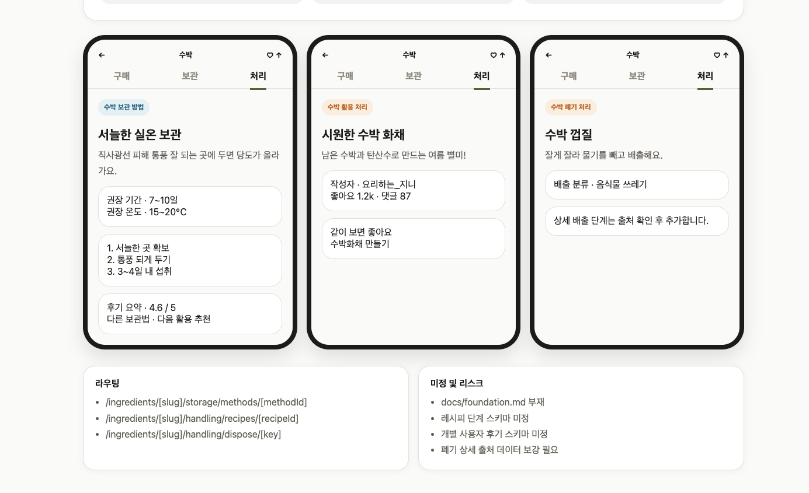
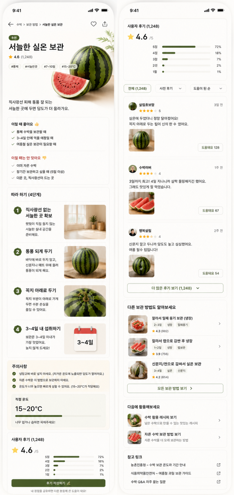

# 처리 디테일 화면 기획

## 한 줄 정의

처리 탭에서 활용 레시피 카드와 폐기 처리 카드를 눌렀을 때, 사용자가 바로 실행할 수 있는 상세 정보로 이어지는 화면이다.

## 참조 이미지

이번 상세 페이지 개발은 아래 이미지를 참조한다. 이미지는 구현 에셋이 아니라 화면 구조와 정보 위계를 맞추기 위한 기획 레퍼런스다.

### 디테일 화면 3종 구조

- 보관 카드 클릭 → 보관 방법 디테일 화면으로 이동한다.
- 활용 처리 카드 클릭 → 레시피 디테일 화면으로 이동한다.
- 폐기 처리 카드 클릭 → 폐기/분리배출 디테일 화면으로 이동한다.
- 세 화면 모두 기존 재료 상세 앱바와 구매/보관/처리 탭 맥락을 유지한다.

### 보관 방법 상세 레퍼런스

- 보관 상세는 목록 카드보다 깊은 실행 화면이다.
- 상단에는 방법명, 평점, 태그, 대표 이미지/비주얼을 둔다.
- 본문은 추천/비추천 상황, 따라 하기 단계, 주의사항, 적정 온도, 후기 요약, 다른 보관 방법, 다음 활용, 참고 링크 순서로 구성한다.
- 개별 사용자 후기와 사진 후기는 현재 스키마에 없으므로 임의 생성하지 않는다.

## 문제 (Why)

처리 탭은 남은 재료를 활용하거나 버리는 순간에 쓰인다. 목록 카드만으로는 “어떻게 만들지”, “왜 이렇게 버려야 하는지”, “주의할 점이 있는지”까지 확신하기 어렵다. 카드 클릭 이후의 상세 화면이 없으면 처리 탭은 탐색에서 멈추고 실행으로 이어지지 않는다.

## 대상 & 시나리오 (Who/When)

살림 초보 사용자가 남은 수박을 보고 “먹을 수 있으면 활용하고, 버려야 하면 제대로 버리고 싶다”고 판단하는 순간에 쓴다.

시나리오 1: 사용자는 처리 탭의 `활용 처리`에서 “시원한 수박 화채” 카드를 누른다. 상세 화면에서 설명, 작성자, 반응, 참고 영상을 보고 따라 할지 결정한다.

시나리오 2: 사용자는 처리 탭의 `폐기 처리`에서 “수박 껍질” 카드를 누른다. 상세 화면에서 배출 분류, 배출 방법, 주의점, 출처를 보고 음식물 쓰레기로 배출할지 판단한다.

## 핵심 가치 매핑

- 빠른 확신: 목록 카드에서 바로 상세로 들어가 실행 정보를 확인한다.
- 믿음: 폐기 처리는 출처와 지역 차이 안내를 별도 영역으로 보여준다.
- 끝까지: 구매/보관 이후 남은 재료 활용과 폐기까지 앱 안에서 마무리한다.

## 영역 & 정보 성격

처리 영역이다. 처리 안에서도 두 갈래로 나뉜다.

- 활용 처리: UGC 중심의 확산형 정보다. 작성자, 반응, 참고 영상, 추후 조리 단계가 중요하다.
- 폐기 처리: 분리배출 안내 중심의 정답형 정보에 가깝다. 배출 분류, 이유, 단계, 주의점, 출처가 중요하다.

## 기능 명세

### 처리 목록 진입

- 사용자가 `활용 처리` 카드 클릭 → 시스템은 `/ingredients/[slug]/handling/recipes/[recipeId]`로 이동한다.
- 사용자가 `폐기 처리` 카드 클릭 → 시스템은 `/ingredients/[slug]/handling/dispose/[key]`로 이동한다.
- 사용자는 상세 화면에서도 상단 구매/보관/처리 탭을 볼 수 있고, 처리 탭 active 상태가 유지된다.

### 활용 처리 상세

- 사용자가 레시피 상세에 진입 → 시스템은 레시피 제목, 설명, 작성자, 카테고리, 좋아요/댓글 수를 보여준다.
- 레시피에 `media[]`가 있으면 참고 영상 목록을 보여준다.
- 레시피 상세 단계 데이터가 없으면 조리 단계는 추측하지 않고 “상세 단계 준비 중” 안내를 보여준다.
- 사용자가 하단 버튼 클릭 → 처리 목록으로 돌아간다.

### 폐기 처리 상세

- 사용자가 폐기 상세에 진입 → 시스템은 폐기 항목명, 카드 요약 방법, 배출 분류 배지를 보여준다.
- `reason`, `steps`, `cautions`, `regionNote`, `source`가 있으면 각각 별도 섹션으로 노출한다.
- 상세 필드가 없으면 임의로 내용을 만들지 않고 “출처 확인 후 추가” 안내를 보여준다.
- 사용자가 하단 버튼 클릭 → 처리 목록으로 돌아간다.

### 보관 방법 상세

- 사용자가 보관 방법 카드 클릭 → 시스템은 `/ingredients/[slug]/storage/methods/[methodId]`로 이동한다.
- 상세 화면은 방법명, 요약, 기간, 온도, 태그, 평점, 장금이 코멘트, 단계, 추천/비추천 상황, 주의점, 출처를 보여준다.
- `steps[]`가 비어 있으면 상세 단계 준비 중 안내를 보여준다.
- 추가 레퍼런스 기준으로 사용자 후기 요약, 다른 보관 방법, 다음 활용 추천, 참고 링크를 하단에 배치한다.
- 개별 사진 후기는 현재 스키마에 없으므로 임의 생성하지 않고 `rating.dist` 기반 후기 요약만 먼저 노출한다.

## 데이터 & 필터

### 활용 처리 상세 데이터

- `handling.recipes[].id`: 상세 라우트 식별자
- `handling.recipes[].title`: 상세 제목
- `handling.recipes[].category`: 카테고리 배지
- `handling.recipes[].desc`: 상세 요약 설명
- `handling.recipes[].author`: 작성자 영역
- `handling.recipes[].reaction`: 좋아요/댓글 수
- `handling.recipes[].media`: 참고 영상
- `handling.recipes[].source`: 선택 출처

### 폐기 처리 상세 데이터

- `handling.dispose[].key`: 상세 라우트 식별자
- `handling.dispose[].title`: 상세 제목
- `handling.dispose[].way`: 카드 및 상세 요약 방법
- `handling.dispose[].wasteType`: 배출 분류 배지
- `handling.dispose[].reason`: 왜 이렇게 배출하는지
- `handling.dispose[].steps`: 배출 단계
- `handling.dispose[].cautions`: 주의점
- `handling.dispose[].regionNote`: 지역별 기준 차이 안내
- `handling.dispose[].source`: 공식/전문 출처

### 보관 방법 상세 데이터

- `storage.methods[].id`: 상세 라우트 식별자
- `storage.methods[].title`, `summary`: 상세 제목/요약
- `storage.methods[].durationDays`, `conditions`: 기간/조건
- `storage.methods[].tags`: 필터 태그
- `storage.methods[].steps`: 보관 단계
- `storage.methods[].goodFor`, `notFor`, `cautions`: 추천/비추천/주의점
- `storage.methods[].rating`, `source`, `media`, `janggeumiComment`: 신뢰와 보조 정보
- `storage.methods[]` 전체: 현재 방법을 제외한 다른 보관 방법 추천
- `handling.recipes[]`: 보관 이후 이어질 활용 추천

## 성공 지표 (How measure)

- 처리 탭 카드 클릭률
- 상세 화면 진입 후 처리 목록 복귀율
- 폐기 상세에서 출처 링크 클릭률
- 활용 상세에서 참고 영상 클릭률
- 보관 방법 상세에서 평균 체류 시간

## 범위 밖 / 미정

- `docs/foundation.md`가 현재 repo에 없어 foundation 핵심 가치 원문 대조는 하지 못했다.
- 레시피 재료, 조리 시간, 조리 단계 스키마는 아직 없다. 이번 구현은 기존 `Recipe` 스키마 안에서만 표현한다.
- 보관 상세의 개별 사용자 후기 리스트는 현재 스키마에 없다. 이번 구현은 평점 분포만 보여준다.
- 폐기 상세의 `reason/steps/source`는 현재 수박 데이터에 비어 있다. 추측 작성하지 않고 UI만 준비한다.
- FigJam 최종 화면과 라우트 네이밍은 후속으로 싱크한다.
